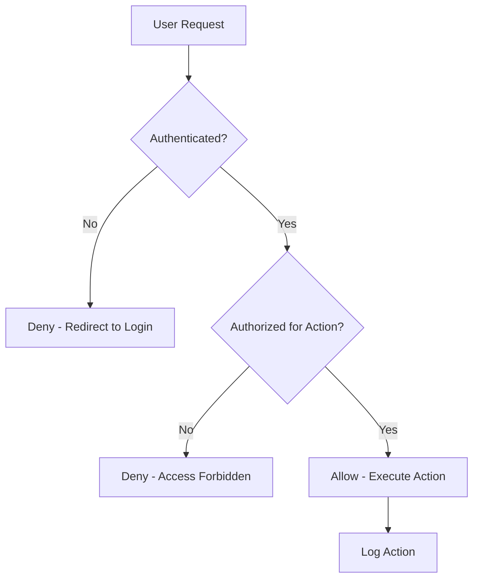
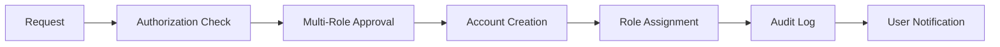

# Test Mermaid Rendering

This is a test document to verify Mermaid diagram rendering.

## Authorization Flow

```mermaid
graph TD
    A[User Request] --> B{Authenticated?}
    B -->|No| C[Deny - Redirect to Login]
    B -->|Yes| D{Authorized for Action?}
    D -->|No| E[Deny - Access Forbidden]
    D -->|Yes| F[Allow - Execute Action]
    F --> G[Log Action]
```

## User Creation Process

```mermaid
graph LR
    A[Request] --> B[Authorization Check]
    B --> C[Multi-Role Approval]
    C --> D[Account Creation]
    D --> E[Role Assignment]
    E --> F[Audit Log]
    F --> G[User Notification]
```

End of test document.
